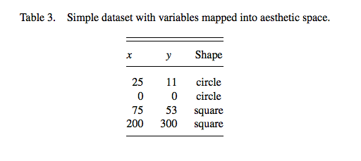
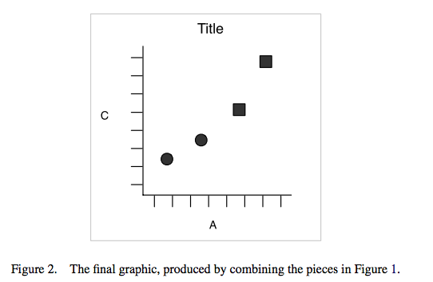

```
## [1] "C"
```
#Data visualisation with R (Week 3)

##Introduction

A picture is worth a thousand words; when presenting and interpreting data this basic idea also applies. There has been, indeed, a growing shift in data analysis toward more visual approaches to both interpretation and dissemination of numerical analysis. Part of the new data revolution consists in the mixing of ideas from visualisation of statistical analysis and visual design. Indeed data visualisation is one of the most interesting areas of development in the field.

Good graphics not only help researchers to make their data easier to understand by the general public. They are also a useful way for understanding the data ourselves. In many ways it is very often a more intuitive way to understand patterns in our data than trying to look at numerical results presented in a tabular form. 

Recent research has revealed that papers which have good graphics are perceived as overall more clear and more interesting, and their authors perceived as smarter (see [this presentation](https://vimeo.com/181771433))

The preparation for this session includes many great resources on visualising quantitative information, and if you have not had time to go thorugh them, I recommend that you take some time to do so. 

As with other aspects of R, there are a number of core functions that can be used to produced graphics. However these offer limited possibilities for building graphs. 

The package we will be using throughout this tutorial is `ggplot2`. The aim of ggplot is to implement the [grammar of graphics](http://www.springer.com/statistics/computational+statistics/book/978-0-387-24544-7). The `ggplot2` package has excellent online [documentation](http://ggplot2.org/).

If you don't already have the package installed, you will need to do so using the `install.packages()` function. 
 
 You will then need to load up the package
 

```r
library(ggplot2)                                  
```

The grammar of graphics defines various components of the graphic. Some of the most important are:

-**The data**: For using `ggplot2` the data has to be stored as a data frame

-**The geoms**: They describe the objects that represent the data (e.g., points, lines, polygons, etc.).

-**The aesthetics**: They describe the visual characteristics that represent data (e.g., position, size, colour, shape, transparency).

-**Facets**: They describe how data is split into subsets and displayed as multiple small graphs.

-**Stats**: They describe statistical transformations that typically summarise data.

##Anatomy of a plot

Essentially the philosophy behind this as that all graphics are made up of layers. The package ggplot2 is based on the grammar of graphics, the idea that you can build every graph from the same few components: a data set, a set of geoms<U+2014>visual marks that represent data points, and a coordinate system.

Take this example (all taken from *Wickham, H. (2010). A layered grammar of graphics. Journal of Computational and Graphical Statistics, 19(1), 3-28.*)

You have a table such as: 



You then want to plot this. To do so, you want to create a plot that combines the following layers: 


This will result in a final plot: 



Let's have a look at what this looks like for a graph. 

Let's have a look at some data about [banning orders](https://www.gov.uk/government/publications/football-related-arrests-and-banning-orders-england-and-wales-season-2016-to-2017/football-related-arrests-and-banning-order-statistics-england-and-wales-2016-to-2017-season) for different football clubs. 

First you need to read the data. We keep this data in a website and you can download it with the following code:


```r
fbo_url <- "https://raw.githubusercontent.com/maczokni/R-for-Criminologists/master/fbo-by-club-supported-cleaned.csv"
fbo <- read.csv(url(fbo_url))
```

Now let's explore the question of number of banning orders for clubs in different leagues. But as a first step, let's just plot the number of banning orders for each club. Let's build this plot:


