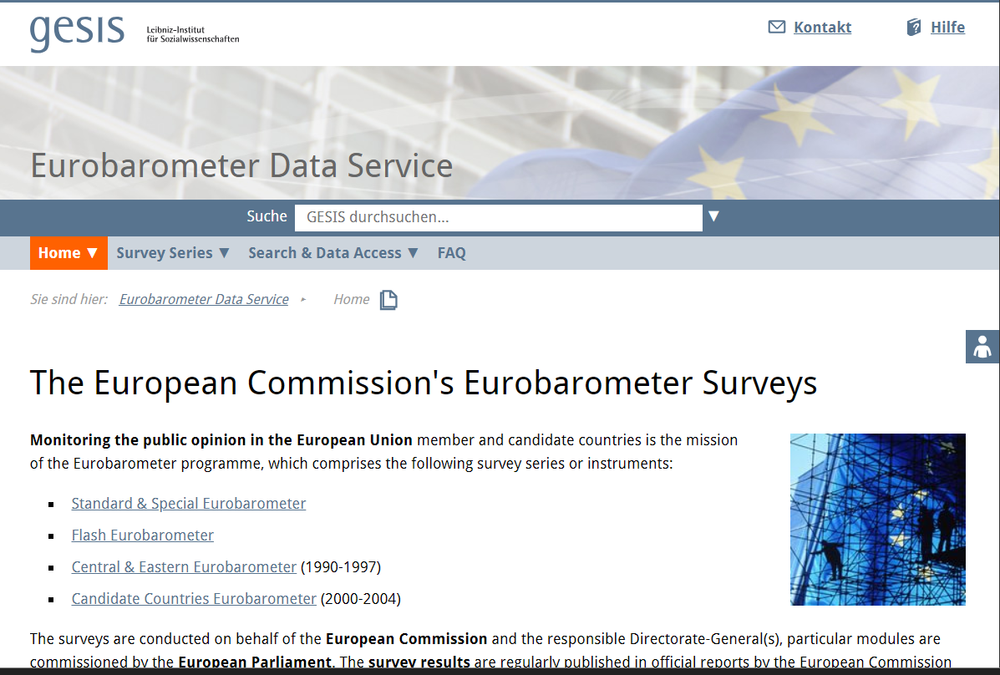
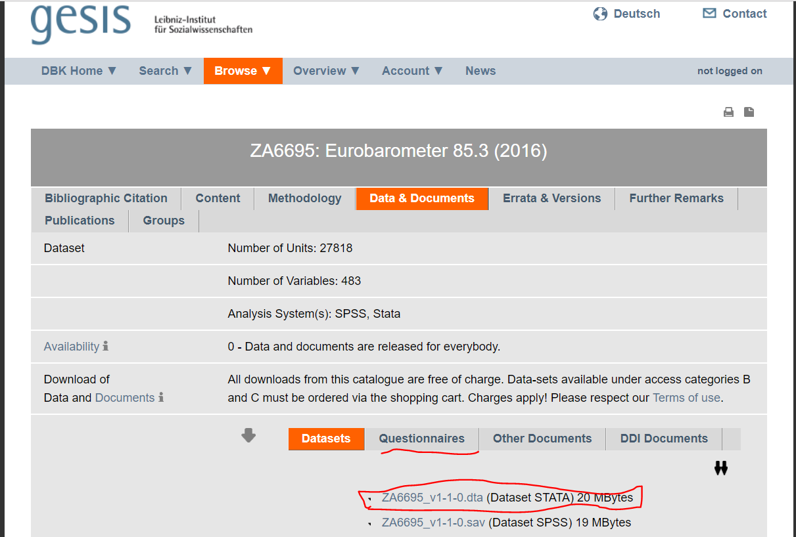
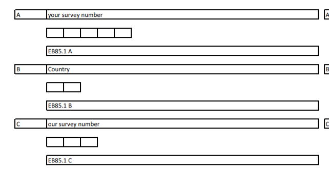
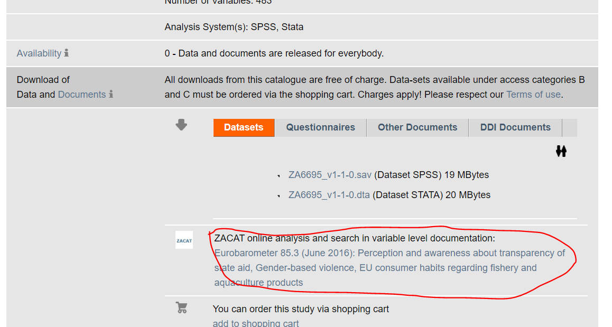
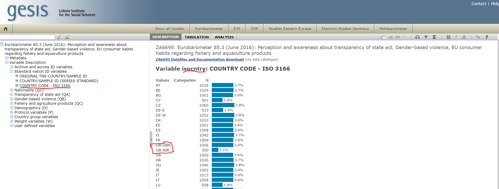
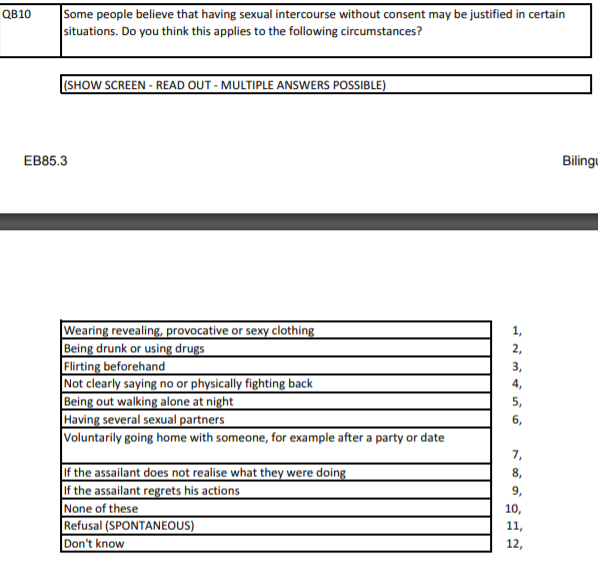
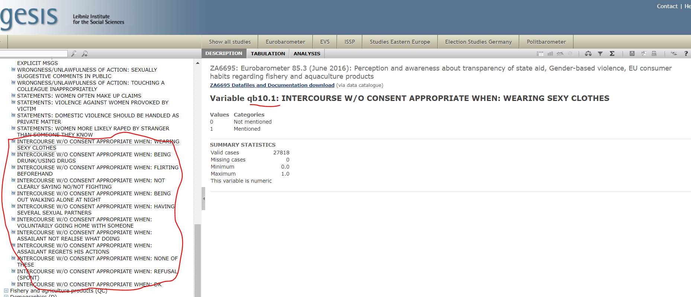

#Data Carpentry (Week 4)

##Introduction

There are many situation in the process of data analysis where you have to work around your data to get it in shape ready for analysis.You may need for example to change your existing variables or create new variables (often using information stored in existing ones) in order to achieve your analytical goals. In this session, we are going to discuss and cover some of the scenarios in which this may be required and also explain how to do this. These skills will be particularly useful for getting your data ready for your coursework assignment.

For this practical we will use the data from a Eurobarometer. Eurobarometers are opinon polls conducted regularly on behalf of the European Commission since 1973. Some of them ask the same questions over time to evaluate changes in European's views in a variety of subjects (standard Eurobarometers). Others are focused on special topics and are conducted less regularly (special Eurobarometers). They are a useful source of datasets that you could use for your undergraduate dissertation.

The data from these surveys is accessible through the data catalog of GESIS, a data warehouse at the Leibniz Institute for the Social Sciences in Germany. For downloading data from GESIS you have to register with them (following the registration link) [here](https://dbk.gesis.org/dbksearch/register.asp). Once you activate your registration you should be able to access the data at GESIS.

 

GESIS has a section of their website devoted to the Eurobarometer survey. You can access that section [here](https://www.gesis.org/eurobarometer-data-service/home/). You could navigate this webpage to find the data we will be using for this tutorial, but to save time I will provide you a direct link to it. We will be using the special Eurobarometer 85.3 form 2016. This survey among other things asked Europeans about their views on gender violence.

 

You can access the data for this eurobarometer [here](https://dbk.gesis.org/dbksearch/sdesc2.asp?no=6695&db=e&doi=10.4232/1.13169). 

 

You will see here that there are links to the files with the data in SPSS and STATA format. You can also see a tab where you could obtain the questionnaire for the survey. Once you are registered download the STATA version of the file and also an English version of the questionnaire. Make sure you place the file in your working directory. Once you do this you should be able to use the code we are using in this session.

First, we will load the data into our session. Since the data is in STATA format we will need to read the data into R using the `haven` package. Specifically, we will use the `read_dta` function for importing STATA data into R. As an argument we need to write the name of the file with the data (and if it is not in your working directory, the appropriate pathfile).


```r
library(haven)
eb85_3 <- read_dta("ZA6695_v1-1-0.dta")
dim(eb85_3)
```

```
## [1] 27818   483
```
We can see there are over 27000 cases (survey participants) and 483 variables. 

##Thinking about your data

For the final coursework assignment, you will need to download other datasets but the process will be similar in that once you have the datasets you will need to think about what cases and what variables you want to work with. Imagine that we had to write our final assignment using this dataset and that we had to write a report about attitudes to sexual violence.

First, we would need to think if we wanted to use all cases in the data or only a subset of the cases. For example, when using something like the Eurobarometer we would need to consider if we are interested in exploring the substantive topic across Europe or only for some countries. Or alternatively you may want to focus your analysis only on men attitudes to sexual violence. In a situation like this you would need to filter cases. 

So, for example, if we only wanted to work with the UK sample we would need tho figure out if there is a variable that identifies the country in the dataset. In the questionnaire you can see indeed that there is such a variable:

 

What we do not know is how this variable is named in the dataset. For this we need to look at the codebook. In this case, we can look at the interactive facility provided for GESIS for online data analysis, which provides an interactive online codebook for this dataset. You can access this facility in the link higlighted in the image below:

 

You can access similar applications for the two datasets that you need to use for the final coursework assignment. If you will use the ESS you can use an online facility [here](http://nesstar.ess.nsd.uib.no/webview/) and if you are using the CSEW you can acccess a similar tool [here](http://nesstar.ukdataservice.ac.uk/webview/).

Let's explore the online facility for the Eurobarometer. If we expand the menus in the left hand side by clickin in variable description, and then in standard nation id variables, you will see there is a variable that provides a "country code". This must be it. click on it and then you will see in the right hand side some information about this variable. You see the name of this variable (as it will appear in the dataset) "isocntry" and we can see this variable uses [ISO 3166](https://en.wikipedia.org/wiki/ISO_3166) codes to designate the country. This is an international standard set of abbreviations for country names. For the UK these codes are GB-GBN and GB-NIR (for Northern Ireland).

 

Now that we have this information we can run the code to select only the cases that have these values in the dataset. For doing something like that we would use the `dplyr::filter` function. We used the `filter` function in week 2. You can read more about it in the `dplyr` vignette. 


```r
library(dplyr)
```

```
## 
## Attaching package: 'dplyr'
```

```
## The following objects are masked from 'package:stats':
## 
##     filter, lag
```

```
## The following objects are masked from 'package:base':
## 
##     intersect, setdiff, setequal, union
```

```r
#First, let's see what type of vector isocntry is
class(eb85_3$isocntry)
```

```
## [1] "character"
```

```r
uk_eb85_3 <- filter(eb85_3, isocntry %in% c("GB-GBN", "GB-NIR"))
```

The variable `isocntry` is a character vector with codes for the different participating countries. Here we want to select all the cases in the survey that have either of two values in this vector (GB-GBN or GB-NIR). Since these values are text we need to use quotes to wrappen them up. Because we are selecting more one value we cannot simply say `isocntry == "GB-BGN"`. We also need the cases from Northern Ireland. So, we use a particular operator introduced by `dplyr` called the piping operator (`%in%`). Basically, here we are creating a vector with the values we want and then asking R to look at those values within the isocntry vector so that we can filter everything else out. We will come back to the piping operator in greater detail later on.

If you run this code you will end up with a new object called `uk_eb85_3` that only has 1306 observations. We have now a dataset that only has the British participants.

##Selecting variables

Perhaps for your coursework you define your essay question in such a way that you do not need to do any a priori filtering. Perhaps, for the sake of this example, we decide to do an analysis that focuses on looking at attitudes toward sexual violence for all of Europe and for all participants. Yet, you won't be using 483 variables for certain. Among other reasons because our guidelines for the essay suggest you use fewer variables. The first thing you need to do is think about what variables you are going to use. This involves first thinking about what variables are available in the dataset that measure your outcome of interest.

The thing you are interested in explaining or better understanding is attitudes regarding sexual violence. So, you would need to spend some time thinking about how this survey measures these attitudes. You would need to screen the questionnaire and the codebook to identify these variables and their names in the dataset. Have a look at the questionnaire. The questions about gender violence start at the bottom of page 7. Which of these questions are questions about attitudes towards sexual violence?

**Homework 1: Identify the name of all the variables that pertain to attitudes toward sexual violence. You will need this list in front of you when doing the Blackboard test**

Once you have all of this you would need to think about which of these survey questions and items make more sense for your research question. This is something where you will need to use your common sense but also your understanding of the literature in the topic. Criminologists and survey researchers spend a lot of time thinking about what is the best way of asking questions about topics or concepts of interest. They often debate and write about this. So, as part of your essay, you will need to consider what do researchers consider are good questions to tap into the concepts you are studying.

There are many items in this survey that relate to this topic (and you need to identify as part of homework 1), but for purposes of continuing our illustration we are going to focus on the answers to question QB10. This question asks respondents to identify in what circumstances may be justified to have sexual intercourse without consent. The participants are read a list of items (e.g., "flirting before hand") and they can select various of them if so they wish.

 

Ok, so we have now selected our variable. Say that we have done so on the basis of our understanding of the literature. Next we need to identify these variables in the dataset. What name is associated with this variable? Let's look at the online interactive facility.



Damn! We have one question but several variables! This is common when the question in the survey allows for multiple responses. Typically when this is read into a dataset, survey researchers create a variable for each of the possible multiple responses. If the respondent identified one of those potential responses they will be assigned a "yes" or a "1" for that column. If they did not they will be assigned a "no" or a "0". Let's see how this was done in this case:


```r
class(eb85_3$qb10_1)
```

```
## [1] "haven_labelled"
```

This is a vector labelled by haven. We could see what labels were used using the `attributes` function.


```r
attributes(eb85_3$qb10_1)
```

```
## $label
## [1] "INTERCOURSE W/O CONSENT APPROPRIATE WHEN: WEARING SEXY CLOTHES"
## 
## $format.stata
## [1] "%8.0g"
## 
## $class
## [1] "haven_labelled"
## 
## $labels
## Not mentioned     Mentioned 
##             0             1
```

We can see here that the value 1 corresponds to cases where this circumstance was mentioned. Let's see how many people considered this a valid circumstance to have sex without consent.


```r
table(eb85_3$qb10_1)
```

```
## 
##     0     1 
## 24787  3031
```

Fortunately, only a minority of respondents.

Apart from thinking about the variables we will use to measure our outcome of interest for the coursework assignment you will need to select some variables that you think may be associated with this outcome. In the essay you will need to select a wider set. Here we will only do a few. Again, this is something that needs to be informed by the literature (what variables does the literature considers important) and your own interest. Let's say we are going to look at gender, political background of the respondent, country of origin, age, occupation of the respondents, and type of community they live in. Most of these are demographic variables (not always the more fun or theoretically interesting), but that's all we have in this eurobarometer and so they will do. The same way you try to identify the names of the variables for your outcome variable, you would need to do this for the variables you use to "explain" your outcome. Once you have done your variable selection you can subset your data to only include these.


```r
df <- select(eb85_3, qb10_1, qb10_2, qb10_3, qb10_4,
             qb10_5, qb10_6, qb10_7, qb10_8, qb10_9,
             qb10_10, qb10_11, qb10_12, d10, d11,
             isocntry, d1, d25, d15a, uniqid)
```

Ta-da! We now have a new object called df with only the variables we will be working with. In this format, it is easier to visualise the data. Notice we have also added a variable called `uniqid`. With many datasets like this you will have a unique id value that allows you to identify individuals. This id may be handy later on, so we will preserve it in our object.

##Creating summated scales

Now comes the next part. What are going to do with this variables? How are we going to use them? Here you need to do some thinking using your common sense and also considering how other researchers may have used this question. There's always many possibilities. We could, for example, consider that we are going to split the sample in two: those that consider any of these circumstances valid and those that didn't. We would then end up with a binary indicator that we could use as our outcome variable in our analysis. The thing is that doing that implies loosing information. We may think that someone that consider many circumstances as valid is not the same than the person that only considers one as valid. Yet, creating a global binary indicator would treat these two individuals in the same way.

Another alternative could be to see how many of these circumstances are considered valid excuses for each individual and to produce a sum then for every respondent. Since there are 9 "excuses" we could have a sum from 0 to 9. Let's do this. We are going to create a new variable that add up the responses to qb10_1 all the way to qb10_9. For this we use the `mutate` function from the `dplyr` package.


```r
df <- mutate(df, 
       at_sexviol = qb10_1 + qb10_2 + qb10_3 + qb10_4 +
         qb10_5 + qb10_6 + qb10_7 + qb10_8 + qb10_9)
table(df$at_sexviol)
```

```
## 
##     0     1     2     3     4     5     6     7     8     9 
## 19681  2529  2117  1643   841   416   255   155    57   124
```

We have a skewed distribution. Most people in the survey consider that none of the identified circumstances are valid excuses for having sexual intercourse without consent. On the other hand, only a minority of individuals (124) consider that all of these 9 circumstances are valid excuses for having sex without consent. A high score in this count variable is telling you the participant is more likely to accept a number of circumstances in which sexual intercourse without consent is acceptable. You may read more about count data of this kind [here](https://en.wikipedia.org/wiki/Count_data).

Hold on for a second, though. There is a variable `qb10_10` that specifies people that answered "none of these" circumstnaces. In theory the number of people with a "1" in that variable (that is, selected this item) should equal 19681 (the number of zeros in our new variable). Let's check this out:


```r
table(df$qb10_10)
```

```
## 
##     0     1 
##  9400 18418
```

Oops! Something does't add up! Only 18418 people said that none of these circumstances were valid. So why when we add all the other items we end up with 19681 rather than 18418? Notice that there is also a qb10_11 and a qb10_12. These two items identify the people that refused to answer this question and those which did not know how to answer it. 


```r
table(df$qb10_11)
```

```
## 
##     0     1 
## 27563   255
```

```r
table(df$qb10_12)
```

```
## 
##     0     1 
## 26810  1008
```

There are 255 people that refused to answer and 1008 that did not know how to answer. If you add 1008, 255, and 18418 you get 19681. So our new variable is actually computing as zeroes people that did not know how to answer this question or refused to answer it. We do not want that. We do not know what these people think, so it would be wrong to assume that they consider that none of these circumstances are valid excuses for sexual intercourse without consent.

There are many ways to deal with this. He could simply filter out cases where we have values of 1 in these two variables (since we don't know their answers we could as well get rid of them). But We could also recode the variable to define this values as what they are NA (missing data, cases for whivh we have no valid information).


```r
df$at_sexviol[df$qb10_11 == 1 | df$qb10_12 == 1] <- NA
table(df$at_sexviol)
```

```
## 
##     0     1     2     3     4     5     6     7     8     9 
## 18418  2529  2117  1643   841   416   255   155    57   124
```

Pay attention to the code above. When we want to recode based in a condition we use something like data. What we are saying with that code is that we are going to assign as NA (missing data) the cases for which the condition between the square brackets are met. Those conditions are as defined, when the participants answered don't know or refused to answer the question (that is when qb10_11 or qb10_12 equals 1). You can see other scenarios for recoding using this kind of syntax in the resources we link below. The | sign is used to denote the logical condition "OR". You can see other logical operators used in R [here](https://www.datamentor.io/r-programming/operator/).

Notice that once we do the recoding and rerun the frequency distribution you will see we achieved what we wanted. Now all those missing cases are not counted as zero.

##Collapsing categories in character variables

One of the variables we selected is the country in which the participant lives. Let's have a look at this variable.


```r
table(df$isocntry)
```

```
## 
##     AT     BE     BG     CY     CZ   DE-E   DE-W     DK     EE     ES 
##   1016   1029   1001    501   1060    533   1052   1010   1001   1008 
##     FI     FR GB-GBN GB-NIR     GR     HR     HU     IE     IT     LT 
##   1042   1009   1006    300   1000   1026   1046   1002   1013   1004 
##     LU     LV     MT     NL     PL     PT     RO     SE     SI     SK 
##    508   1010    500   1003   1002   1000   1007   1109   1012   1008
```

There are 30 countries in the sample. You may consider that for the purposes of your analysis maybe that is too much. For the sake of this tutotial, let's say that maybe you are not really interested in national differences but in regional differences across different parts of Europe. Say you may want to explore whether these attitudes are different across Western/Central Europe, Scandinavian countries, Mediterranean countries, and Eastern Europe. You do not have a variable with these categories but since you have a variable that gives you the nations you could create such a variable. How would you do that?

First, you need to consider what the new categories are going to be and how you are going to distribute the countries in your sample across those categories. You may do that in a piece of paper. Then you would need to write the code to have a new variable with this information.

We are going to group the countries in 4 regions: Western (AT, BE, CZ, DE-E, DE-W, FR, GB-GBN, GB-NIR, IE, LU, NL), Eastern (BG, EE, HU, LT, LV, PL, RO, SK), Southern (CY, ES, GR, HR, IT, MT, PT, SI), and Northern Europe (DK, FI, SE).

Here we use code similar to the one above. We will have a variable with four new categories (Western, Southern, Eastern, and Northern) whenever the right conditions are met. See the code below:


```r
df$region[df$isocntry == "AT" | df$isocntry == "BE" | 
            df$isocntry == "CZ" | df$isocntry == "DE-E" |
            df$isocntry == "DE-W" | df$isocntry == "FR" |
            df$isocntry == "GB-GBN" | df$isocntry == "GB-NIR" |
            df$isocntry == "IE" | df$isocntry == "LU" |
            df$isocntry == "NL"] <- "Western"
```

```
## Warning: Unknown or uninitialised column: 'region'.
```

```r
df$region[df$isocntry == "BG" | df$isocntry == "EE" |
            df$isocntry == "HU" | df$isocntry == "LT" |
            df$isocntry == "LV" | df$isocntry == "PL" |
            df$isocntry == "RO" | 
            df$isocntry == "SK"] <- "Eastern"
df$region[df$isocntry == "DK" | df$isocntry =="FI" |
            df$isocntry == "SE"] <- "Northern"
df$region[df$isocntry == "CY" | df$isocntry == "ES" |
            df$isocntry == "GR" | df$isocntry =="HR" |
            df$isocntry == "IT" | df$isocntry =="MT" |
            df$isocntry == "PT" | 
            df$isocntry =="SI"] <- "Southern"

table(df$region)
```

```
## 
##  Eastern Northern Southern  Western 
##     8079     3161     7060     9518
```

What we are doing above is initialising a new variable in the `df` object that we are calling `region`. We are then assigning to each of the four categories in this character vector those participants in the survey that have the corresponding values in the `isocntry` variable as defined for each category within the square brackets. So for example if Austria) we are telling R we want this person to be assign the value of "Western" in the `region` variable. And so on. You can see the list of ISO country codes [here](https://en.wikipedia.org/wiki/List_of_ISO_3166_country_codes).

Once you have created the variable you could start exploring if there is any association with our outcome variable. For example, using mosaic plots from tje `vcd` package (if you don't have it installed the code won't run).


```r
library(vcd)
```

```
## Loading required package: grid
```

```r
mosaic(~region + at_sexviol, data = df)
```


In a mosaic plot like this the height of the region levels indicate how big that group is. You can see there are many more observations in our sample that come from Western countries than from Northern countries. Here what we are interested is the lenght. We see that Northern countries have proportionally more people in the zero category than any other group. On the other hand, Eastern countries have the fewer zeros (so looking as if attitudes more permisive towards sexual violence are more common there, even if still minoritary). We will come back to this kind of plots later on this semester.

##Working with apparently cryptic variable names and levels

Let's look at the variable d10 in our dataset:


```r
table(df$d10)
```

```
## 
##     1     2 
## 12230 15588
```

What is this? Unclear, isn't it? If you look at the questionnaire you will see that this variable measures gender, that values of 1 correspond to men and that values of 2 corresponds to woman. But this is far from straighforward just by looking a the printed table or the name of the variable.

To start with we may want to change the name of the variable. One way to do this is the following:


```r
colnames(data)[colnames(data)=="old_name"] <- "new_name"
```

Of course, we need to change the names for valid ones in our case. So adapting that code we would write as follows:


```r
colnames(df)[colnames(df)=="d10"] <- "gender"
```

If you now check the names of the variables in `df` you will see what has happened:


```r
names(df)
```

```
##  [1] "qb10_1"     "qb10_2"     "qb10_3"     "qb10_4"     "qb10_5"    
##  [6] "qb10_6"     "qb10_7"     "qb10_8"     "qb10_9"     "qb10_10"   
## [11] "qb10_11"    "qb10_12"    "gender"     "d11"        "isocntry"  
## [16] "d1"         "d25"        "d15a"       "uniqid"     "at_sexviol"
## [21] "region"
```

If you want to change many variable names it may be more efficient doing it all at once. First we are going to select fewer variables and retain only the ones will continue using:


```r
df <- select(df, uniqid, at_sexviol, gender, d11, d1, d25, d15a, region)
```

Now we can change a bunch of names all at once with the following code:


```r
names(df)[4:7] <- c("age", "politics", "urban", "occupation")
names(df)
```

```
## [1] "uniqid"     "at_sexviol" "gender"     "age"        "politics"  
## [6] "urban"      "occupation" "region"
```
 
You may have seen we wrote `[4:7]` above. That is indicating to R that we only wanted to change the name of the variables defining column 4 to 7 in the dataframe, those corresponded to d11, d1, d25, and d15a, which respectively (we can see in the questionnaire) correspond to age, politics, whether the respondent live in a urban setting, and occupation. We assign to those columns the names we specify (in the appropriate order) in the list that follows. Now we will be less likely to confuse ourselves, since we have columns with meaningful names (which will appear in any output and plots we produce).

Let's look at occupation:


```r
table(df$occupation)
```

```
## 
##    1    2    3    4    5    6    7    8    9   10   11   12   13   14   15 
## 1588 1864 1845 8916  129   14  384  768  517  878  313 1921 2202  856 2062 
##   16   17   18 
##  271 2471  819
```

There are 18 categories here. And it is not clear what they mean.


```r
class(df$occupation)
```

```
## [1] "haven_labelled"
```

Remember that this is haven_labelled. If we look at the attributes we can see the correspondence between the numbers above and the labels.


```r
attributes(df$occupation)
```

```
## $label
## [1] "OCCUPATION OF RESPONDENT"
## 
## $format.stata
## [1] "%8.0g"
## 
## $class
## [1] "haven_labelled"
## 
## $labels
##       Responsible for ordinary shopping, etc. 
##                                             1 
##                                       Student 
##                                             2 
##           Unemployed, temporarily not working 
##                                             3 
##                       Retired, unable to work 
##                                             4 
##                                        Farmer 
##                                             5 
##                                     Fisherman 
##                                             6 
##                   Professional (lawyer, etc.) 
##                                             7 
##              Owner of a shop, craftsmen, etc. 
##                                             8 
##                    Business proprietors, etc. 
##                                             9 
## Employed professional (employed doctor, etc.) 
##                                            10 
##                      General management, etc. 
##                                            11 
##                       Middle management, etc. 
##                                            12 
##                    Employed position, at desk 
##                                            13 
##                 Employed position, travelling 
##                                            14 
##                Employed position, service job 
##                                            15 
##                                    Supervisor 
##                                            16 
##                         Skilled manual worker 
##                                            17 
##                 Unskilled manual worker, etc. 
##                                            18
```

Having to look at this every time is not very convenient. You may prefer to simply use the labels directly. For this we can use the `to_factor` function from the `labelled` package.


```r
library(labelled)
```

```
## Warning: package 'labelled' was built under R version 3.5.2
```

```
## 
## LABELLED 2.0.0: BREAKING CHANGE
## 
## Following version 2.0.0 of `haven`, `labelled()` and `labelled_spss()` now produce objects with class 'haven_labelled' and 'haven_labelled_spss', due to conflict between the previous 'labelled' class and the 'labelled' class used by `Hmisc`.
## 
## A new function `update_labelled()` could be used to convert data imported with an older version of `haven`/`labelled` to the new classes.
```

```r
df$f_occup <- to_factor(df$occupation)
class(df$f_occup)
```

```
## [1] "factor"
```

```r
table(df$f_occup)
```

```
## 
##       Responsible for ordinary shopping, etc. 
##                                          1588 
##                                       Student 
##                                          1864 
##           Unemployed, temporarily not working 
##                                          1845 
##                       Retired, unable to work 
##                                          8916 
##                                        Farmer 
##                                           129 
##                                     Fisherman 
##                                            14 
##                   Professional (lawyer, etc.) 
##                                           384 
##              Owner of a shop, craftsmen, etc. 
##                                           768 
##                    Business proprietors, etc. 
##                                           517 
## Employed professional (employed doctor, etc.) 
##                                           878 
##                      General management, etc. 
##                                           313 
##                       Middle management, etc. 
##                                          1921 
##                    Employed position, at desk 
##                                          2202 
##                 Employed position, travelling 
##                                           856 
##                Employed position, service job 
##                                          2062 
##                                    Supervisor 
##                                           271 
##                         Skilled manual worker 
##                                          2471 
##                 Unskilled manual worker, etc. 
##                                           819
```

Now you have easier to interpret output.

##Recoding factors

As we said there are many different types of objects in R and depending on their nature the recoding procedures may vary. You may remember that many times categorical variables will be encoded as factors. Let's lgo back our newly created `f_occup`. We have 18 categories here. These are possibly too many. Some of them have to few cases, like `fisherman`. Although this is a fairly large dataset we only have 14 fisherman. It would be a bit brave to guess what fishermen across Europe think about sexual violence based in a sample of just 14 of them. This is a very common scenario when you analyse data. In these cases is helpful to think of ways of adding the groups with small counts (like fishermen in this case) to a broader but still meaningful category. You also have to think theoretically, do you have good enough reasons to think that there's ought to be meaningful categories in attitudes to sexual violence among these 18 groups? If you don't you may want to collapse into fewer categories that may make more sense.

As when we created the `region` variable the first thing to do is to come out with a new coding scheme for this variable. We are going to use the following.

    1	Self-employed (5 to 9 in d15a)	
    2	Managers (10 to 12 in d15a)	
    3	Other white collars (13 or 14 in d15a)	
    4	Manual workers (15 to 18 in d15a)	
    5	House persons (1 in d15a)	
    6	Unemployed (3 in d15a)	
    7	Retired (4 in d15a)	
    8	Students (2 in d15a)
    
In right life it would be quicker to recode from `d15a` into a new variable. But here we are going to use this to show you how to recode from a factor variable, so instead we will recode form `f_occup`. As often in R, there are multiple ways of doing this. Here we will show you how to do this using the `recode` function from the `car` library.


```r
df$occup2 <- df$f_occup
levels(df$occup2) <- list("Self-employed" = 
                            c("Farmer" , "Fisherman" ,
                              "Professional (lawyer, etc.)" ,
                              "Owner of a shop, craftsmen, etc.",
                              "Business proprietors, etc."),
                          "Managers" = 
                            c("Employed professional (employed doctor, etc.)",
                              "General management, etc.", 
                              "Middle management, etc."),
                          "Other white collar" = 
                            c("Employed position, at desk", 
                              "Employed position, travelling"),
                          "Manual workers" = 
                            c("Employed position, service job",
                              "Supervisor",
                              "Skilled manual worker",
                              "Unskilled manual worker, etc."),
                          "House persons" = "Responsible for ordinary shopping, etc.",
                          "Unemployed" = "Unemployed, temporarily not working",
                          "Retired" =  "Retired, unable to work",
                          "Student" = "Student")

table(df$occup2)
```

```
## 
##      Self-employed           Managers Other white collar 
##               1812               3112               3058 
##     Manual workers      House persons         Unemployed 
##               5623               1588               1845 
##            Retired            Student 
##               8916               1864
```

One of the things you need to be very careful with when recoding factors or character variables is that you need to input the chunk of texts in the existing variables exactly as they appear in the variable. Otherwise you will get into trouble. So, for example, if in the code above you wrote `fishermen` instead of `Fisherman` you would have 14 less cases in the `Self-Employed` level than you should have.

##Further resources

There are many other ways to recode variables and create new variables based in existing ones. Here we only provided some examples. We cannot exhaust all possibilities in this tutorial. For the purposes of the assignment you may have specific ideas of how you may want to combine variables or recode existing ones. You can find additional examples and code for how to do the recoding of variables in the following links. Please make sure that you spend some time looking at these additional resources. They are not optional.

[Wrangling categorical data in R](https://peerj.com/preprints/3163.pdf)

[http://rprogramming.net/recode-data-in-r/](http://rprogramming.net/recode-data-in-r/)

[http://www.cookbook-r.com/Manipulating_data/Recoding_data/](http://www.cookbook-r.com/Manipulating_data/Recoding_data/)

[https://mgimond.github.io/ES218/Week03a.html](https://mgimond.github.io/ES218/Week03a.html)

[https://www.r-bloggers.com/from-continuous-to-categorical/](https://www.r-bloggers.com/from-continuous-to-categorical/)

You should also look for the dplyr documentation for the functions mutate() and recode().

If you would like to combine several variables into one for your analysis in more complex ways but do not know how to do that, please do get in touch. Also do not hesitate to approach us if you have any other specific queries.


